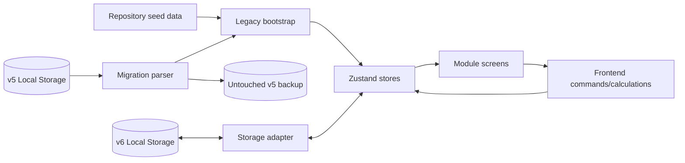
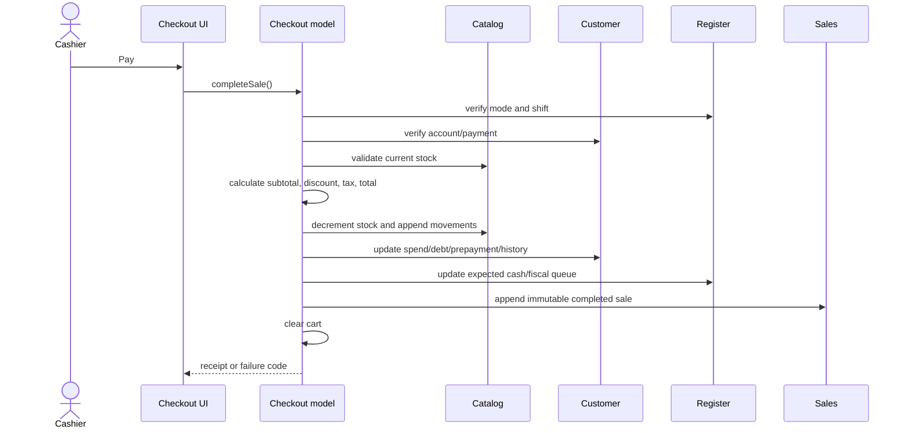
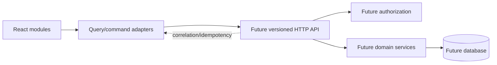

# Data Flow

## Current data sources

Dashboard demonstration series are deterministic calculations from selected ranges and store seeds. Reports aggregate current sales and operational stores. No production data is fetched from an external service.

## Critical sale flow

## Future boundary

The right side is a proposed integration boundary only. It is not implemented in this repository.
