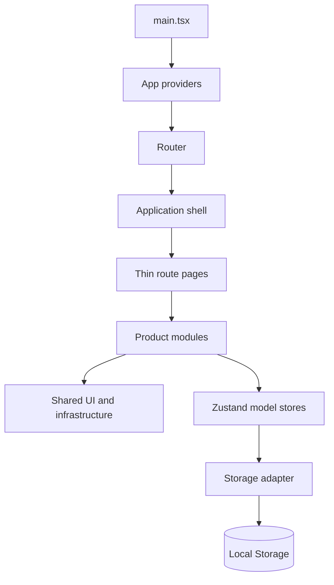

# Frontend Architecture

## Style

DinoPOS is a modular client application, not a distributed system. React route screens compose focused domain stores and pure calculations. Zustand stores currently act as both client state and the local prototype repository; proposed API boundaries are documented for later replacement.

## Dependency direction

1. `app` may use pages, shared code, and public session APIs.
2. `pages` may use module root entry points.
3. A module may use shared code and another module's public root/model API.
4. Shared code may not use product modules, except the quarantined legacy compatibility layer.
5. Model code must not import screens or app code.
6. Runtime module cycles are rejected by `pnpm check:boundaries`.

## Business transactions

Frontend orchestration remains where it already existed:

- Checkout completes a sale across checkout, catalog, customer, register, and sales stores.
- Returns coordinate sales, catalog, customer, register, and operational history.
- Holds coordinate cart, stock reservation, customer, register, and operational history.

These are deliberate current-state boundaries, not recommendations for backend transaction ownership. Future APIs should make each critical workflow a server-side atomic command.

## Error and interface states

Shared primitives cover dialogs, drawers, empty/error/loading feedback, tooltips, tables, inputs, selects, switches, and buttons. Modules retain their existing domain-specific validation and toast behavior. Visual tokens remain generated from Retail OS Option A and are not duplicated in module files.

## Compatibility exception

`shared/legacy` imports entity schemas directly from module model files to migrate v5 data without introducing module-store initialization cycles. It is the only intentional reverse edge and should disappear after legacy migration support is retired.
