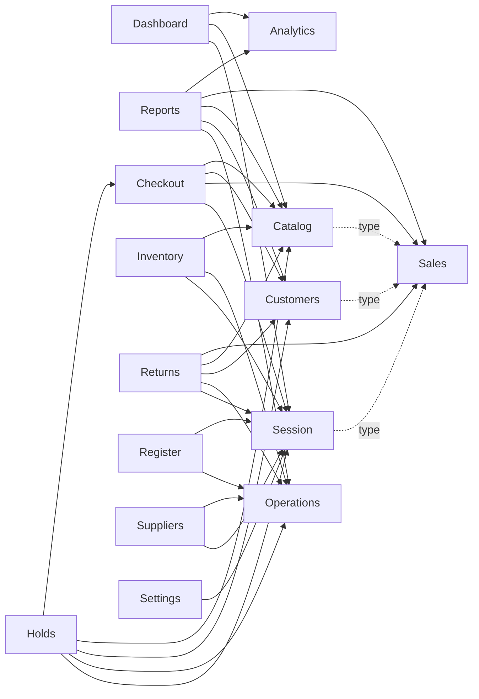

# Module Map

## Product map

Dashed arrows are compile-time type reuse; solid arrows participate in runtime behavior.

## Public APIs

Each module exposes screens through `modules/<name>/index.ts`. Modules that share state or entity contracts expose a narrower `modules/<name>/model/index.ts`. Route pages use root entry points; cross-module model consumers use model entry points. Deep cross-module screen imports are prohibited.

## Route ownership

| Module | Route surfaces |
| --- | --- |
| Checkout | `/checkout`, `/drafts` |
| Dashboard | `/dashboard` |
| Catalog | `/catalog`, `/catalog/import` |
| Inventory | `/inventory`, `/inventory/transfers` |
| Customers | `/customers` |
| Reports | `/reports` |
| Sales | `/sales` |
| Suppliers | `/suppliers` |
| Returns | `/returns` |
| Holds | `/holds` |
| Register | `/shift`, `/cash-operations`, `/register-history` |
| Settings | `/settings` |
