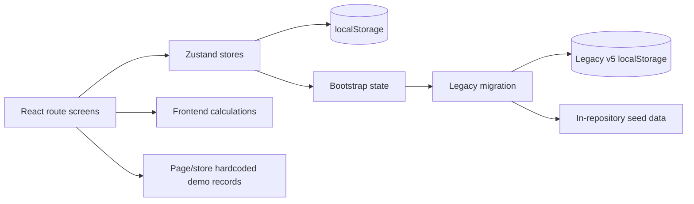

# Current Frontend Structure Audit

Date: 2026-09-20

## Scope and source of truth

This audit records the state of commit `664aa44` before repository restructuring. The working React application is the source of truth for implemented behavior. Earlier UI/UX specifications and screenshots are historical evidence only.

The application is a client-only React 19 and TypeScript POS prototype. It uses Vite, React Router, Zustand persistence, React Hook Form with Zod, TanStack Table, ECharts, React Aria, Radix primitives, i18next, Sonner, Lucide, Tailwind CSS, Vitest, Storybook, and Playwright. There is no backend, API client, database, server-side authentication, ORM, queue, or backend infrastructure.

## Baseline verification

| Check | Baseline result |
| --- | --- |
| Token generation | Pass |
| TypeScript build | Pass |
| Vitest | 7 files, 21 tests passed |
| Production build | Pass |
| Playwright | 16 passed, 10 skipped, 4 failed |

The four Playwright failures are pre-existing test drift. `e2e/modules.spec.ts` expects an H1 named `Dashboard`/`Главная`, while the approved Dashboard intentionally uses the selected store scope (`All stores`/`Все магазины`) as the page context. Checkout flows, navigation customization, responsive overflow checks, accessibility, period controls, and draft persistence pass.

## Build and delivery

- Root package manager: `pnpm@11.19.0`.
- Development: `pnpm dev` runs token generation and Vite.
- Verification: `pnpm check` runs token generation, TypeScript, Vitest, Vite build, and GitHub Pages finalization.
- End-to-end: `pnpm test:e2e` runs Playwright at desktop, tablet, and mobile widths.
- Deployment: `.github/workflows/deploy-pages.yml` publishes the root `dist` directory to GitHub Pages.
- Production base path: `/DinoPOS/`.

## Current directory model

```text
src/
  app/                 application shell, providers, router
  components/          shared UI, data display, navigation, page patterns
  entities/            Zod schemas and entity types
  features/            route screens and checkout/analytics logic
  i18n/                legacy and current translation catalogs
  lib/                 formatting, class merging, legacy migration, nav preferences
  stores/              all Zustand stores
  stories/             Storybook stories
  styles/              global and generated theme CSS
  tests/               test setup
```

## Architectural observations

### Strengths

- Routes are centralized and lazy loaded.
- Product behavior is already grouped by feature names.
- Shared visual primitives are reusable and token-based.
- Core entities have Zod schemas.
- Persistence keys are versioned.
- Checkout calculations and completion logic have focused unit tests.
- The Dashboard period/granularity model is separately tested.
- Legacy state migration creates a backup before conversion.

### Problems to resolve

1. Route composition and product implementation are the same files under `features`.
2. Domain models live in `entities`, stores in a global `stores` folder, and screens in `features`, so one module is spread across three roots.
3. `operations-store.ts` contains suppliers, purchase orders, transfers, returns, holds, cash operations, shift history, stocktakes, and imports.
4. Shared data visualization and date components import the product session store, reversing the intended dependency direction.
5. Every persistent store directly accesses `localStorage` and repeats storage-key strings.
6. Router base-path configuration is calculated inside the router rather than a central environment boundary.
7. Pages import store internals directly rather than module public entry points.
8. Several route screens contain validation schemas, calculations, table definitions, data access, and rendering in one file.
9. Mock data is split between legacy seed files, store-local arrays, and page-local preview rows.
10. Historical architecture and visual documents sit beside current documentation without lifecycle labels.
11. The root README describes the project but does not index complete architecture, module, or future-integration documentation.
12. The E2E route inventory is stale relative to the approved Dashboard title.

## State management and persistence

Zustand is the only runtime state manager. The following localStorage keys are public compatibility contracts and must remain unchanged during restructuring:

| Key | Owner | Persisted data |
| --- | --- | --- |
| `dinopos-v6-session` | session/register | store selection, register, fiscal/online state, locale, theme, navigation preferences |
| `dinopos-v6-catalog` | catalog/inventory | products, held quantities, movements |
| `dinopos-v6-checkout` | checkout | cart, customer, discount, payment method, drafts |
| `dinopos-v6-customers` | customers | customers and account transactions |
| `dinopos-v6-sales` | sales | completed sales |
| `dinopos-v6-operations` | operational records | suppliers, POs, transfers, returns, holds, cash operations, shift history, stocktakes, imports |
| `dinopos-v6-settings` | settings | company, payment, receipt, taxes, rounding, permissions |
| `retailos-unified-brief-v5-i18n` | legacy migration input | legacy unified application state |
| `dinopos-v5-backup` | legacy migration backup | untouched copy of legacy state |

`sessionStorage` is not used.

## Current data sources



- All product data is local or generated in the browser.
- Dashboard demonstration analytics are deterministic frontend-generated data.
- Reports aggregate persisted sales, products, customers, and operational records in the browser.
- No external product data source is currently used.

## Business-logic concentration

- Checkout: cart mutation, totals, stock validation, fiscalization, customer balance mutation, stock decrement, sale creation, and receipt state.
- Catalog/inventory: product validation, stock adjustment, transfer stock changes, held stock, sale stock movements.
- Customers: debt, prepayment, purchase history, and account transactions.
- Register: shift lifecycle, expected cash, fiscal queue, and store-switch restriction.
- Operations: purchase orders, returns, holds, transfers, cash movements, shift history, stocktakes, imports.
- Analytics: period/range/granularity rules, demo series generation, and reports aggregation.

## Dependency concerns

The main dependency direction is currently:

```text
app -> components + features + stores
features -> components + entities + stores + lib
stores -> entities + legacy lib
components -> stores (in several places)
legacy lib -> entities + formatting
```

The problematic edge is `components -> stores`. Shared UI should receive locale/data as props or use generic localization infrastructure, not depend on product state. Cross-feature behavior should be consumed through module entry points after restructuring.

## Existing documentation classification

| Document | Classification |
| --- | --- |
| `retail-os-ui-foundation.md` | Current visual-system reference |
| `dashboard-visual-foundation.md` | Current Dashboard reference |
| approved/current screenshots | Current visual evidence |
| `design-research.md` | Historical research context |
| `legacy-audit.md` | Historical migration audit |
| `react-architecture.md` | Historical migration proposal |
| pilot/earlier screenshots | Historical visual context |

Historical items will be moved to `docs/archive/` and retained, not deleted.

