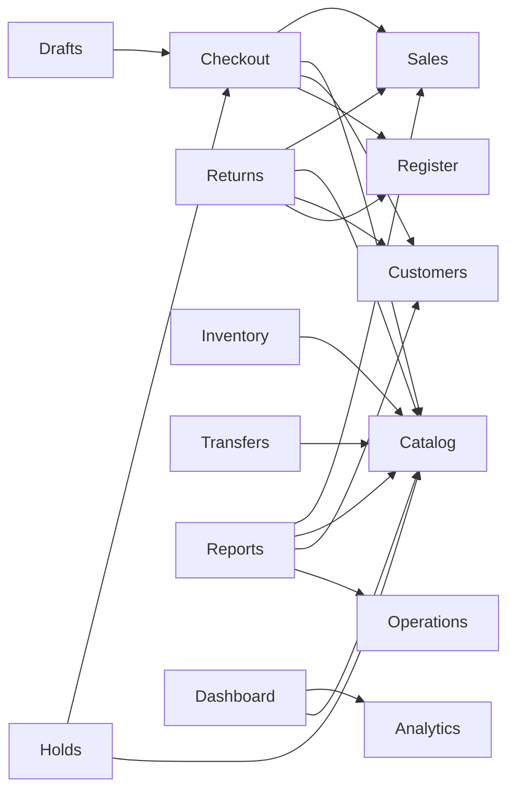

# Feature and Route Inventory

Date: 2026-09-20  
Baseline commit: `664aa44`

## Route summary

| Route | Screen | Module | Purpose | Primary actions | Current source | Main dependencies |
| --- | --- | --- | --- | --- | --- | --- |
| `/` | Redirect | App | Open the operational starting point | Redirect to Checkout | Router | Checkout |
| `/checkout` | Checkout | Checkout | Run an in-person sale | search/scan, filter, add/remove, quantity, customer, discount, payment, draft, pay, receipt, open shift | catalog/customer/session/checkout/sales stores | Catalog, Customers, Sales, Register |
| `/dashboard` | Dashboard | Dashboard/Analytics | Network overview and urgent exceptions | store scope, period, custom dates, granularity, open sale/inventory | deterministic analytics + catalog/session stores | Analytics, Catalog, Stores |
| `/catalog` | Products and services | Catalog | Maintain sellable products/services | search, type/category filters, create, edit, import link, sort/page | catalog store | Inventory, Session |
| `/catalog/import` | Import | Catalog/Operations | Preview imports and scan an item | choose file, validate preview, finish import, barcode/SKU lookup | page demo preview + catalog/operations stores | Catalog, Operations |
| `/inventory` | Inventory | Inventory | Inspect and adjust physical stock | status filter, stock adjustment, start stocktake, movement paging | catalog/operations/session stores | Catalog, Operations, Stores |
| `/inventory/transfers` | Transfers | Inventory/Operations | Move stock between stores | choose stores/item/qty, save draft, send, receive | catalog/operations/session stores | Catalog, Operations, Stores |
| `/customers` | Customers | Customers | Manage customer accounts | search, balance filter, add customer, inspect profile, add prepayment | customer/session stores | Sales account rules, Session |
| `/reports` | Reports | Reports/Analytics | Analyze sales and operating balances | period/store/date filters, export simulation, charts, table sort/page | sales/catalog/customer/operations/session stores | Analytics and all reporting domains |
| `/sales` | Sales | Sales | Browse completed receipts | search, payment filter, export simulation, receipt detail | sales/session stores | Checkout, Session |
| `/suppliers` | Suppliers | Suppliers/Operations | Review suppliers and purchase orders | create PO, sort/page | operations/session stores | Stores, Operations |
| `/returns` | Returns and exchanges | Returns/Operations | Refund or exchange an existing sale | select sale, type, amount, payout, process | sales/catalog/customer/operations/session stores | Sales, Inventory, Customers, Register |
| `/drafts` | Drafts | Checkout | Resume or discard saved carts | restore, delete, navigate to checkout | checkout/session stores | Checkout |
| `/holds` | Holds | Holds/Operations | Reserve a cart for a customer with deposit | create from cart, redeem, cancel/release | checkout/catalog/customer/operations/session stores | Checkout, Inventory, Customers, Register |
| `/shift` | Cash shift | Register | Open, monitor, and close a register shift | open, view cash, open operations, return checkout, count/close | session/operations stores | Stores, Employees, Cash operations |
| `/cash-operations` | Cash operations | Register | Record non-sale drawer movements | income/expense/collection, reason, amount | session/operations stores | Register |
| `/register-history` | Shift history | Register | Review immutable closed shifts | sort/page | operations/session stores | Register, Stores |
| `/settings` | Settings | Settings | Configure company and device behavior | company, theme, fiscalization, online, mode, methods, receipt, tax, language, permissions, employees | settings/session stores | Session, Employees |
| `*` | Fallback | App | Recover unknown URLs | Redirect to Checkout | Router | Checkout |

## Detailed route behavior

### Checkout (`/checkout`)

- **Actions:** text search; barcode/SKU Enter scan; All/Favorites/Products/Services filter; add item; increment/decrement/remove line; select customer; 0–100% receipt discount; choose cash/card/QR/transfer/debt/prepayment; save draft; open shift; complete payment; close/send receipt; mobile product/cart toggle; `/` focus shortcut; Cmd/Ctrl+Enter pay shortcut.
- **Data:** products, stock by store, held quantities, customer balances, register/session, cart, sales.
- **States:** empty product result, empty cart, closed shift, insufficient prepayment, stock changed, fiscal/non-fiscal, online/offline fiscal queue, payment success, validation toast.
- **Rules:** full register requires open shift; cart cannot exceed available stock; prepayment cannot exceed customer credit; sale completion updates sales, stock, customer, register and cart atomically at the frontend orchestration level.
- **Components:** product tile, cart line, status bar, open-shift dialog, receipt dialog, payment controls.

### Dashboard (`/dashboard`)

- **Actions:** choose one/many/all stores; Yesterday/Today/Week/Month/Year; custom date range; compatible hour/day/week/month granularity; New sale; View all inventory.
- **Data:** store list, generated time series, current product stock.
- **States:** multiple series, tooltip/zoom for dense series, at most three urgent low-stock exceptions, store summary.
- **Rules:** period, range, labels, totals, previous-period comparison and granularity use one dataset; granularity options depend on period/duration.
- **Components:** analytics filters, store picker, time-series chart, period summary, operational exceptions, store performance.

### Catalog (`/catalog`)

- **Actions:** search name/SKU/barcode/supplier; All/Product/Service; category; create/edit; sort/page; open import.
- **Data:** products and selected-store stock.
- **States:** empty results, create/edit dialog, form errors, duplicate barcode toast.
- **Rules:** name/SKU/category/supplier required; barcode minimum 3 and unique; price positive; cost/stock nonnegative; service stock displays as not applicable.

### Import (`/catalog/import`)

- **Actions:** choose `.xlsx`/`.csv`; view three-row demo validation; finish valid import; scan barcode/SKU; inspect import history.
- **Data:** page-local preview rows, products, persisted import records.
- **States:** empty drop zone, preview validation, import history empty/completed, product found/not found.
- **Limitation:** file contents are not parsed and valid preview rows are not added to catalog; this is an explicit open question for future integration.

### Inventory (`/inventory`)

- **Actions:** All/Low/Out filter; adjust stock; start stocktake; sort/page stock and movement history.
- **Data:** physical products, held quantities, movements, purchase orders, selected store.
- **States:** low/out semantic status, empty tables, adjustment errors/success.
- **Rules:** services excluded; adjustment cannot produce negative stock; quantity cannot be zero; stocktake begins at 0% in progress.

### Transfers (`/inventory/transfers`)

- **Actions:** select source/destination/item/quantity; save draft; send; receive.
- **Data:** products, stores, transfer records.
- **States:** draft, sent, accepted; validation/insufficient-stock errors.
- **Rules:** stores must differ; quantity positive; sending decrements source; receiving increments destination; accepted transfer cannot be received again in UI.

### Customers (`/customers`)

- **Actions:** search, All/Debt/Prepayment filter, add customer, view profile, add prepayment.
- **Data:** customer accounts and transactions, locale.
- **States:** empty results, add/profile dialogs, debt/prepayment semantic values.
- **Rules:** name min 2; phone min 5; loyalty required; prepayment addition must be positive; checkout updates spend, debt/prepayment, and receipt history.

### Reports (`/reports`)

- **Actions:** store/period/date filters; export simulation; chart interaction; table sort/page.
- **Data:** sales, products, customers, purchase orders, stores.
- **States:** time series, top items, payment share, cashier table, no-data chart/table, export loading/success.
- **Rules:** revenue/cost/profit and rankings are calculated in the frontend; customer debt and supplier balance are current totals rather than historical snapshots.

### Sales (`/sales`)

- **Actions:** receipt/customer/cashier search; payment filter; export simulation; receipt detail.
- **Data:** completed persisted sales.
- **States:** fiscalized/non-fiscal, empty table, detail dialog.
- **Rules:** sale records are appended by checkout; UI provides no mutation/deletion.

### Suppliers (`/suppliers`)

- **Actions:** create purchase order; sort/page.
- **Data:** seeded suppliers, purchase orders, stores.
- **States:** created/accepted/paid/return, pending balance, form errors.
- **Rules:** supplier/store required; products positive integer; amount positive.

### Returns (`/returns`)

- **Actions:** choose sale; return/exchange; amount; cash/prepayment payout; process.
- **Data:** sales, products, customers, register, return records.
- **States:** completed history; validation/closed-shift errors.
- **Rules:** amount > 0 and <= sale total; full register requires open shift; current implementation restores one unit from the first sale line; cash reduces expected drawer, prepayment credits customer.

### Drafts (`/drafts`)

- **Actions:** continue draft; delete draft.
- **Data:** persisted checkout drafts.
- **States:** empty list; restore/delete success.
- **Rules:** only non-empty carts save; save clears cart; restore removes draft and opens cart view; drafts do not reserve stock.

### Holds (`/holds`)

- **Actions:** create from current cart and customer; set deposit; redeem; cancel.
- **Data:** cart, customers, held stock, register, holds.
- **States:** active/redeemed/cancelled, no-cart disabled create, closed-shift error.
- **Rules:** active hold reserves stock; cancel releases it; redeem requires open shift in full mode, releases reservation, then decrements stock; deposit is displayed as liability but no customer financial transaction is recorded.

### Shift (`/shift`)

- **Actions:** select cashier/opening amount and open; inspect drawer; navigate to cash operations/checkout; enter counted cash and close.
- **Data:** register, employees, stores, cash operations, shift history.
- **States:** closed/open, balanced/variance, validation.
- **Rules:** active employee and nonnegative opening cash; store cannot change while shift open; closing appends immutable history and resets register state.

### Cash operations (`/cash-operations`)

- **Actions:** record income, expense, or collection with amount/reason.
- **Data:** register and cash-operation history.
- **States:** shift-required error, form validation, activity table.
- **Rules:** open shift required; amount positive; reason min 2; income raises expected cash, expense/collection lower it.

### Register history (`/register-history`)

- **Actions:** sort/page only.
- **Data:** closed shift records and store names.
- **States:** balanced or variance semantic status, empty table.
- **Rules:** UI does not edit history; variance = counted − expected.

### Settings (`/settings`)

- **Actions:** save company; toggle theme/fiscalization/online/register mode/payment methods/receipt fields/permissions; save tax/fees/rounding; set language; add employee.
- **Data:** settings and session stores.
- **States:** persisted controls, form validation, status list, open-shift mode restriction.
- **Rules:** register mode cannot change during open shift; tax/service fee 0–100; language applies immediately and persists; light is default unless user explicitly changes theme.

## Cross-module flows

