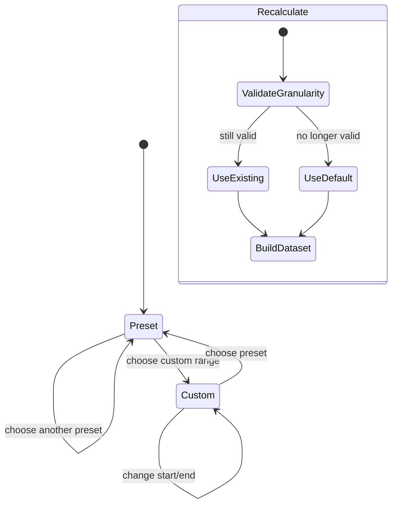

# Analytics Module

## Purpose

Analytics provides reusable period, date-range, store-scope, granularity, aggregation, and comparison logic for Dashboard and Reports. It does not own a route, persist analytics state, or provide a production reporting backend.

## Related Screens

- Consumed by `/dashboard` and `/reports`.
- Components: `AnalyticsFilters` and date/store controls.
- Model: `dashboard-analytics.ts` for deterministic Dashboard series; `model.ts` for filtering and aggregating persisted sales.
- Public entry: `modules/analytics/index.ts`.

## Functionality

- Presets: Yesterday, Today, Week, Month, Year; custom two-calendar range.
- Store scope: one, many, or all stores.
- Compatible granularity choices and defaults.
- Current/previous equal-duration range calculation.
- Deterministic multi-store Dashboard series, totals, and percent comparison.
- Reports sale filtering, daily revenue/cost/profit/orders aggregation, sale cost, and top-five products.
- Locale-aware axis labels and dense-series zoom support in chart consumers.

## Entities and Fields

| Entity | Fields | Meaning |
| --- | --- | --- |
| `AnalyticsPeriod` | yesterday/today/week/month/year/custom | User period intent |
| `AnalyticsGranularity` | hour/day/week/month | Bucket size, independent of selected range |
| `DashboardStoreInput` | ID/name/data color index | Selected series definition |
| `DashboardAnalytics` | labels, series, current/previous totals and comparisons | One internally consistent chart dataset |
| `AnalyticsPoint` | label, revenue, cost, profit, orders | Reports daily aggregate |

## Business Rules

| Status | Rule |
| --- | --- |
| Confirmed | Yesterday/Today allow hour; Week allows hour/day; Month allows hour/day/week; Year allows day/week/month. |
| Confirmed | Defaults are hour for day presets, day for Week/Month, and month for Year. |
| Confirmed | Custom ranges <=2 days allow hour/day; <=45 day/week; <=180 day/week/month; longer week/month. |
| Confirmed | Previous comparison uses the immediately preceding range of equal inclusive duration. |
| Confirmed | Period, range, granularity, labels, series, totals, and comparison are built from one selected dataset. |
| Confirmed | Reports cost uses the current product cost multiplied by sale quantity. |
| Inferred | Dashboard deterministic data exists for visual/product review rather than financial truth. |
| Conflict | Report historical profit can change when current product cost changes because line cost is not snapshotted. |
| Open question | Store timezone/business-day cutoff and server aggregation strategy. |

## States and Transitions



Every period/range/store/granularity change triggers complete recalculation by the screen.

## User Flows

**Change analytical scope:** user selects stores and preset/custom range; UI recomputes valid granularity; invalid previous selection is replaced by default; the same range drives labels, current/previous totals, summary, and tooltip. Errors are limited to invalid date interaction at the control layer; no remote loading state exists today.

## Current Data Handling

Dashboard data is generated in the browser from fixed store daily revenues, month/weekday/hour factors, deterministic variation, and selected dates. Reports aggregate persisted sales/catalog data. Filters are component state and reset on reload. No analytics query, cache, warehouse, or export service exists.

## Future Frontend/Backend Contracts

### Query time-series analytics

| Item | Proposal |
| --- | --- |
| Method/endpoint | `GET /api/v1/analytics/sales-series` |
| Consumer | Dashboard and Reports |
| Parameters | repeated `storeId`, `from`, `to`, `granularity`, timezone, metrics |
| Validation/errors | allowed scope/granularity/range; `400 INVALID_GRANULARITY`, `403 STORE_SCOPE`, `422 RANGE_TOO_LARGE` |
| Permission/effects | `analytics:read`; read-only, no entity effect |
| Idempotency/loading/retry | GET; cancel stale requests; cache by complete query; retry transient failures |

```json
{
  "data": {
    "range": { "from": "2026-01-01", "to": "2026-12-31", "granularity": "month", "timeZone": "Asia/Tashkent" },
    "series": [{ "storeId": "b1", "points": [{ "start": "2026-01-01", "revenue": 412000000, "orders": 1038 }] }],
    "totals": { "revenue": 412000000, "orders": 1038 },
    "previous": { "revenue": 387000000, "comparisonPercent": 6.46 }
  },
  "meta": { "requestId": "req_01J..." }
}
```

The backend must return exact bucket boundaries and currency; the frontend formats but does not reinterpret them.

## Dependencies

Uses Catalog and Sales types/calculations, Session store scope in filters, date libraries, ECharts consumers, and shared date controls. Dashboard and Reports depend on Analytics. Future analytics endpoints replace both demo generation and browser aggregation.

## Open Questions

Timezone/cutoff, net vs gross revenue, returns/discount allocation, historical cost, tax inclusion, data freshness, maximum range, and comparison semantics need approval.

