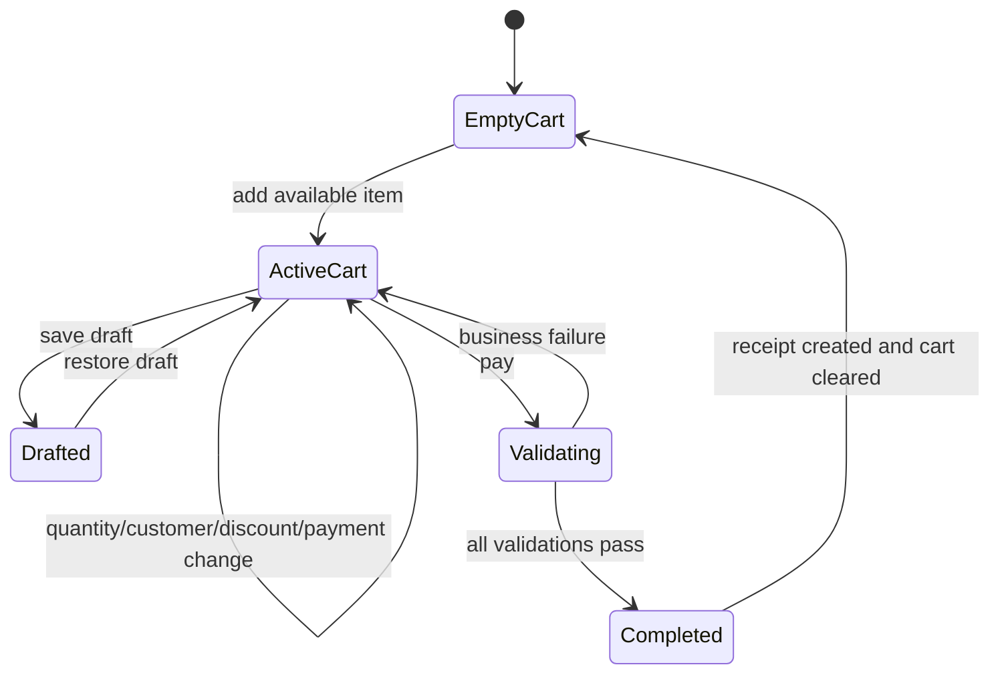
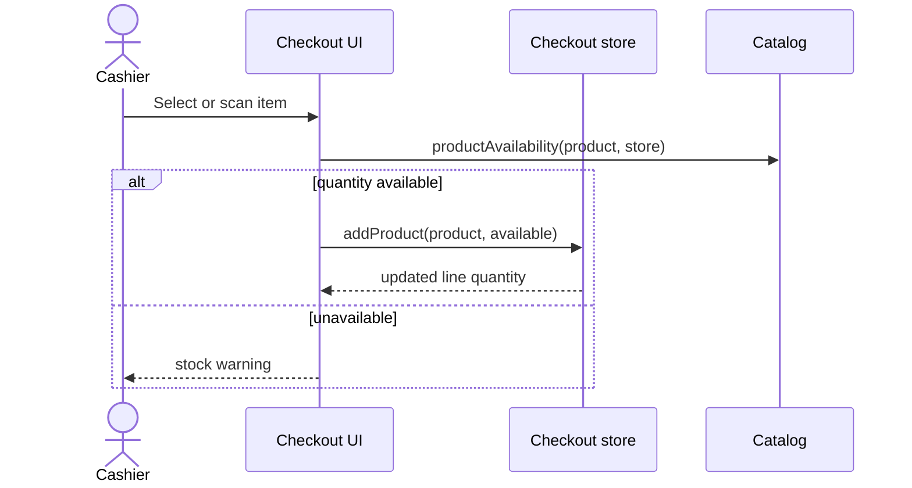
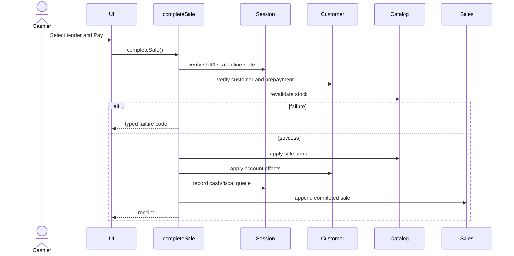

# Checkout Module

## Purpose

Checkout supports the cashier's in-person sale from item discovery through payment and receipt. It owns the cart, receipt discount, selected customer/payment, drafts, totals, and sale-completion orchestration. Catalog maintenance, customer master-data editing, completed-sale browsing, and payment-provider settlement are outside its responsibility.

## Related Screens

- `/checkout`: `CheckoutPage`, product catalog, cart, register status, open-shift and receipt dialogs.
- `/drafts`: `DraftsPage`, restore/delete saved carts.
- Public entry: `apps/web/src/modules/checkout/index.ts`.
- Model entry: `apps/web/src/modules/checkout/model/index.ts`.

## Functionality

- Search name/SKU/barcode and scan by Enter.
- Filter all, favorites, products, or services.
- Add products, enforce available stock, change quantity, remove lines.
- Select customer, apply 0–100% receipt discount, choose payment.
- Support cash, card, QR, transfer, debt, and prepayment.
- Save, restore, and delete drafts; drafts persist across reload.
- Open a shift when full-register mode blocks selling.
- Complete a sale, show receipt, and update all affected client stores.
- Keyboard shortcuts: `/` focuses search; Cmd/Ctrl+Enter attempts payment.
- Empty catalog/cart, closed-shift, stock-change, customer, balance, fiscal, offline, success, and validation states are implemented.

## Entities and Fields

| Entity | Fields | Required/format | Display/relationship |
| --- | --- | --- | --- |
| `CartLine` | `productId`, `name`, `unitPrice`, `quantity`, `lineDiscount` | ID/name required; price >= 0; quantity positive integer; discount 0–100 | One sellable line; product ID links Catalog |
| `CheckoutDraft` | `id`, `createdAt`, `storeId`, `customerId`, `receiptDiscount`, `paymentMethod`, `cart` | ID/date/store required; cart is copied | Restorable checkout snapshot; does not reserve stock |
| `CheckoutTotals` | `subtotal`, `discount`, `tax`, `total` | nonnegative numbers; total rounded | Derived, never entered directly |
| `Sale` | receipt/store/register/shift/cashier/customer/lines/totals/payment/fiscal/status | Zod-validated; at least one line; status `completed` | Produced by successful completion; owned by Sales |

## Business Rules

| Status | Rule |
| --- | --- |
| Confirmed | A product can be added only when active and requested quantity does not exceed physical stock minus held quantity. |
| Confirmed | Services have effectively unlimited stock and are not decremented. |
| Confirmed | Full-register mode requires an open shift; basic mode can sell without one. |
| Confirmed | `subtotal = sum(unitPrice × quantity × (1 - lineDiscount/100))`. |
| Confirmed | Receipt discount is clamped to 0–100%; taxable amount is subtotal minus discount. |
| Confirmed | Tax is 12% only when fiscalization is enabled; total is rounded taxable amount plus tax. |
| Confirmed | Debt and prepayment require a selected existing customer; prepayment must cover the entire total. |
| Confirmed | Completion revalidates stock immediately before mutation. |
| Confirmed | On success, stock, customer ledger/balance, register cash/fiscal queue, sales history, and cart are updated. |
| Confirmed | A draft can be saved only from a non-empty cart; saving clears the current cart. |
| Inferred | A sale is intended to behave atomically, although current browser stores cannot roll back partial JavaScript failures. |
| Open question | Whether configured tax/service fee and enabled payment methods should replace current checkout constants/options. |
| Open question | Whether drafts should expire, synchronize, or reserve stock. |

## States and Transitions



Payment selection changes checkout intent only; financial effects occur on completion.

## User Flows

### Add a product

1. **Actor:** cashier. **Preconditions:** active sellable item and available stock.
2. Search/scan/filter, select item, calculate next quantity, compare with Catalog availability.
3. Add or increment the line; otherwise show unavailable feedback.
4. **Result:** persisted cart changes; no stock movement yet.



### Select payment and complete sale



## Current Data Handling

- Products/customers/session/sales come from persisted Zustand stores initialized by legacy migration or repository seeds.
- Cart, selected customer, discount, payment method, and drafts use `dinopos-v6-checkout`.
- Search/category/mobile view and receipt dialog state are transient.
- Totals, receipt number, fiscal ID, and stock checks are calculated in the browser.
- No payment, fiscal, printer, scanner, or remote inventory API is connected.

## Future Frontend/Backend Contracts

### Complete sale

| Item | Proposal |
| --- | --- |
| Method/endpoint | `POST /api/v1/sales` |
| Consumer | Checkout completion command |
| Validation | non-empty lines; current prices/stock; open shift when required; valid customer/tender; sufficient prepayment |
| Responses | `201`; `401/403`; `409 SHIFT_CLOSED`, `STOCK_CHANGED`, `IDEMPOTENCY_CONFLICT`; `422 INSUFFICIENT_PREPAYMENT` |
| Permission/effects | `sales:create`; atomically create sale/receipt, inventory ledger, customer ledger, drawer/fiscal work |
| Idempotency | Required; one key per Pay attempt |
| Loading/retry | Lock Pay while pending; retry transient failure only with the same key; never optimistic |

```json
{
  "storeId": "b1",
  "registerId": "REG-01",
  "shiftId": "SH-336",
  "customerId": "c1",
  "lines": [{ "productId": "p5", "quantity": 1, "lineDiscountPercent": 0 }],
  "receiptDiscountPercent": 5,
  "payment": { "method": "card", "amount": 8405600 },
  "clientCalculatedTotal": 8405600
}
```

```json
{
  "data": {
    "id": "sale_01J...",
    "receiptNumber": "R-10508",
    "status": "completed",
    "total": 8405600,
    "currency": "UZS",
    "fiscalization": { "status": "completed", "fiscalId": "FISC-482103" }
  },
  "meta": { "requestId": "req_01J..." }
}
```

Draft contracts may use `GET/POST/DELETE /api/v1/checkout-drafts`; stock/search should use Catalog query contracts. Server totals are authoritative; a client total mismatch returns `409 QUOTE_CHANGED` with a refreshed quote.

## Dependencies

- Uses Catalog for sellables/stock, Customers for account effects, Sales for schema/history, Session for store/register/fiscal state, and shared UI.
- Sales, Drafts, Holds, Reports, and Dashboard consume outcomes from Checkout/Sales.
- All cross-store browser orchestration should eventually be replaced by one atomic sales API command.

## Open Questions

- Split tender, partial payment, refunds during payment, tips, and external-terminal callbacks are undefined.
- Receipt numbering/fiscal identity scope and offline fiscal retry policy are undefined.
- Tax inclusivity, item-specific taxes, service fee, and rounding source are unresolved.

