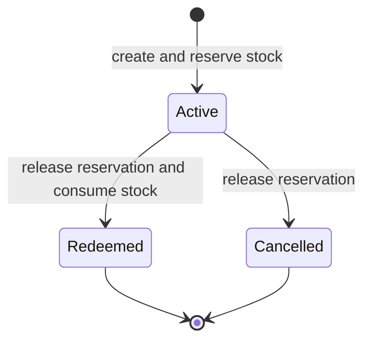

# Holds Module

## Purpose

Holds reserves the current checkout basket for a customer, records a deposit value, and supports redeem/cancel actions. It bridges Checkout and Inventory but is not a full layaway/accounting system.

## Related Screens

- `/holds`: active/history table, create dialog, redeem/cancel actions.
- Public entry: `modules/holds/index.ts`.

## Functionality

Create hold from non-empty cart; select customer; record nonnegative deposit; reserve quantities; clear cart; redeem into stock sale-like consumption; cancel and release reservation; show active/redeemed/cancelled status, liability metric, disabled create, shift error, and success feedback.

## Entities and Fields

`HoldRecord`: ID, customer ID/name, store ID, line snapshots (`productId`, name, quantity, unit price), deposit, status (`active|redeemed|cancelled`), created time.

## Business Rules

| Status | Rule |
| --- | --- |
| Confirmed | Create is disabled for an empty cart. |
| Confirmed | Creation reserves each line in Catalog held quantities and clears Checkout. |
| Confirmed | Active reservations reduce available stock but not physical stock. |
| Confirmed | Cancel releases reservation and marks cancelled. |
| Confirmed | Redeem requires open shift in full mode, releases reservation, decrements physical stock, and marks redeemed. |
| Conflict | Deposit is recorded/displayed as liability but no cash/customer ledger transaction is created. |
| Conflict | Redeem does not create a completed Sale/receipt or settle remaining balance. |
| Open question | Expiry, partial redemption, deposit refund/application, and pricing changes. |

## States and Transitions



## User Flows

**Create:** operator prepares cart, chooses customer/deposit, creates hold; stock becomes reserved and cart clears. **Redeem:** verify shift, release held quantity, apply stock sale movement, mark redeemed. **Cancel:** release held quantity and mark cancelled.

## Current Data Handling

Holds persist in Operations; held quantities persist in Catalog; source cart in Checkout and customers in Customers. Liability/item totals are calculated in the screen. No scheduled expiry or ledger integration exists.

## Future Frontend/Backend Contracts

### Create/redeem hold

| Item | Proposal |
| --- | --- |
| Method/endpoint | `POST /api/v1/holds`; `POST /api/v1/holds/{id}/redeem` |
| Consumer | Holds screen |
| Validation/errors | customer/cart/availability/deposit; active state; shift/payment on redeem; `409 STOCK_CHANGED/INVALID_STATE` |
| Permission/effects | `holds:create/redeem`; atomic reservation and deposit ledger, then sale/settlement on redeem |
| Idempotency/loading/retry | required for both; no optimistic stock/status |

```json
{
  "customerId": "c2",
  "storeId": "b1",
  "lines": [{ "productId": "p5", "quantity": 1 }],
  "deposit": { "amount": 300000, "currency": "UZS", "tender": "cash" }
}
```

```json
{
  "data": { "id": "HOLD-119", "status": "active", "reservedUntil": null, "depositBalance": 300000, "version": 1 },
  "meta": { "requestId": "req_01J..." }
}
```

## Dependencies

Uses Checkout, Catalog, Customers, Operations, Session/Register, and shared UI. Inventory availability is affected. Future Hold commands should atomically own reservation/deposit transitions and create a Sale on redemption.

## Open Questions

Deposit accounting/refund, expiry, notifications, price locking, partial redemption, balance tender, receipts, cancellation permissions, and multi-store redemption are undefined.

