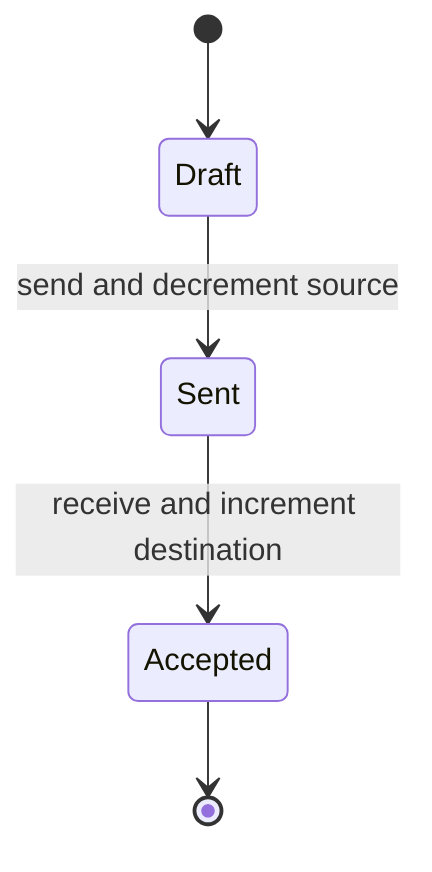
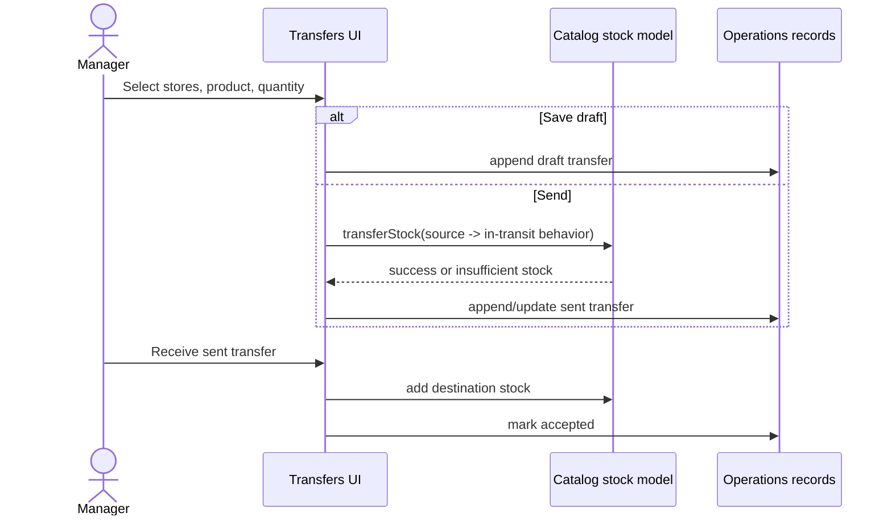

# Inventory Module

## Purpose

Inventory presents physical stock, adjustments, movement history, stocktakes, and inter-store transfers. It composes Catalog stock commands with Operations records. Services and product master-data editing remain Catalog responsibilities.

## Related Screens

- `/inventory`: levels, status filter, adjustment dialog, movement history, stocktake action.
- `/inventory/transfers`: create/send/receive transfers.
- Public entry: `modules/inventory/index.ts`.

## Functionality

Filter all/low/out; sort/page; adjust stock; reject zero/negative-result changes; start stocktake; inspect movements; choose source/destination/product/quantity; save transfer draft; send; receive; show empty, validation, insufficient-stock, success, and status states.

## Entities and Fields

| Entity | Fields | Rules/display |
| --- | --- | --- |
| Product stock | product ID/name/category/unit + `stockByStore` and held quantity | services excluded; available = physical - held |
| `StockMovement` | product/store/type/signed quantity/actor/time | immutable activity row in UI |
| `TransferRecord` | IDs/names, source, destination, quantity, status, created time | `draft`, `sent`, `accepted` |
| `StocktakeRecord` | ID/store/status/progress/variance/time | `in_progress` or `completed`, progress 0–100 |

## Business Rules

| Status | Rule |
| --- | --- |
| Confirmed | Services are excluded from inventory levels and stock mutations. |
| Confirmed | Adjustment quantity cannot be zero or produce negative physical stock. |
| Confirmed | Transfer source/destination must differ; quantity is a positive integer. |
| Confirmed | Sending validates source stock, decrements source, and records transfer movements. |
| Confirmed | Receiving increments destination and marks transfer accepted. |
| Confirmed | UI cannot receive an already accepted transfer. |
| Confirmed | New stocktake begins `in_progress` at 0%. |
| Inferred | Movement rows are intended as audit records; the browser store can technically be cleared. |
| Open question | Stock reservation/ownership while a transfer is in transit and concurrency with sales. |

## States and Transitions



No cancellation/rejection/loss transition is implemented.

## User Flows



## Current Data Handling

Stock lives on Catalog products; held quantities and movements use `dinopos-v6-catalog`. Transfers and stocktakes use `dinopos-v6-operations`. Low/out statuses are derived in the UI. No server locking, inventory snapshot, or real incoming-stock integration exists.

## Future Frontend/Backend Contracts

### Send transfer

| Item | Proposal |
| --- | --- |
| Method/endpoint | `POST /api/v1/inventory/transfers/{id}/send` |
| Consumer | Transfer screen |
| Validation/errors | draft only, stores differ, positive quantity, sufficient available stock; `409 STOCK_CHANGED/INVALID_STATE` |
| Permission/effects | `inventory:transfer`; reserve/decrement source and append immutable ledger atomically |
| Idempotency/loading/retry | required; disable action; retry only same key |

```json
{
  "expectedVersion": 1,
  "lines": [{ "productId": "p5", "quantity": 2 }]
}
```

```json
{
  "data": {
    "id": "TR-208",
    "status": "sent",
    "version": 2,
    "sentAt": "2026-09-20T08:15:00Z"
  },
  "meta": { "requestId": "req_01J..." }
}
```

Other contracts: `GET /inventory/levels`, `GET /inventory/movements`, `POST /inventory/adjustments`, `POST /inventory/transfers`, `POST /inventory/transfers/{id}/receive`, `POST /inventory/stocktakes`, and stocktake line/reconcile commands. Financial/inventory mutations are never optimistic.

## Dependencies

Uses Catalog, Operations, Session/store scope, and shared tables/forms. Checkout, Holds, Returns, Dashboard, and Reports rely on inventory outcomes. Future APIs should replace direct cross-store mutation with inventory commands.

## Open Questions

Reorder thresholds, units, batches/expiry, transfer in-transit accounting, cancellation, partial receipt, stocktake locking, and negative-stock policy are undefined.

