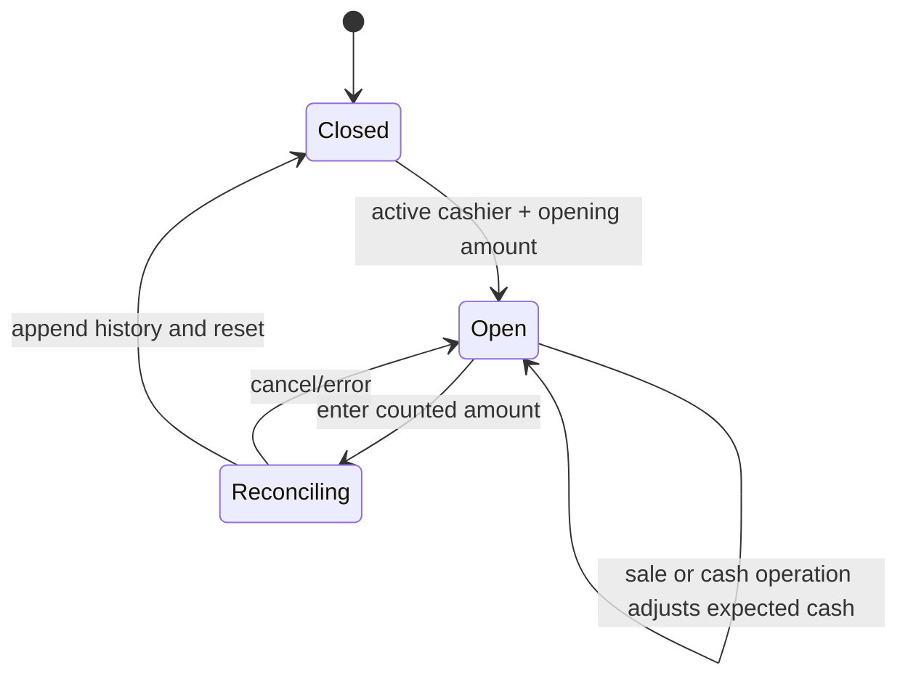
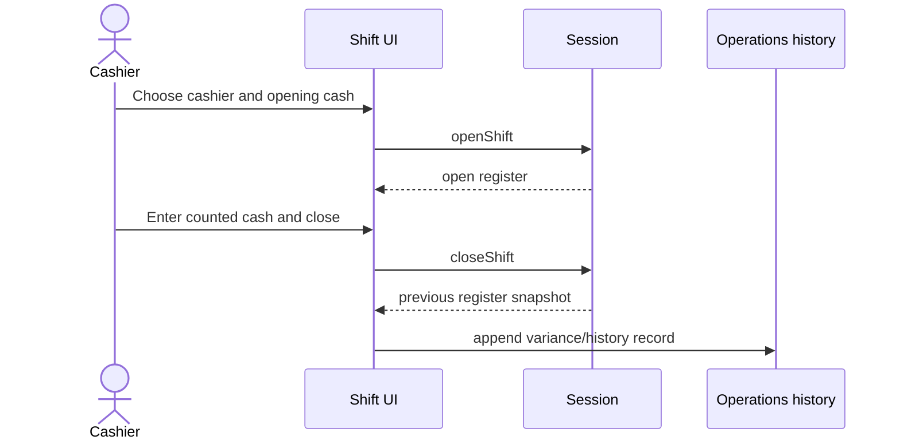

# Register and Shifts Module

## Purpose

Register manages opening/closing a cash shift, expected drawer cash, non-sale cash operations, and closed-shift history. It does not implement server locking, device assignment, or accounting reconciliation.

## Related Screens

- `/shift`: open, monitor, count, and close shift.
- `/cash-operations`: income, expense, collection.
- `/register-history`: immutable closed-shift table.
- Public entry: `modules/register/index.ts`; register state is owned by Session.

## Functionality

Select active cashier/opening amount; open shift; inspect expected cash; navigate to sale/cash operations; count cash and close; calculate variance; append history; record drawer movements with reason; sort/page history; show closed/open/balanced/variance/validation states.

## Entities and Fields

| Entity | Fields | Rules/display |
| --- | --- | --- |
| `Register` | ID/store, open flag, shift/cashier IDs, opening/expected amount, opened time | one current client register |
| `CashOperation` | ID/shift/store/type/amount/reason/actor/time | income, expense, collection |
| `ShiftHistoryRecord` | ID/store/register/cashier/times/opening/expected/counted/variance | appended on close; read-only UI |

## Business Rules

| Status | Rule |
| --- | --- |
| Confirmed | Opening requires an active cashier and nonnegative opening cash. |
| Confirmed | Store and register mode cannot change while shift is open. |
| Confirmed | Cash sale increases expected cash; non-cash tender does not. |
| Confirmed | Income increases expected cash; expense/collection decrease it, clamped at zero. |
| Confirmed | Cash operation requires open shift, positive amount, and reason length >= 2. |
| Confirmed | Close returns current register, appends history, and resets active shift values. |
| Confirmed | Variance = counted amount - expected amount. |
| Inferred | One active shift per register is intended, but browser-only state cannot enforce concurrency. |
| Open question | Approval thresholds, reopening, handover, and fiscal-day rules. |

## States and Transitions



## User Flows



Alternative: validation fails or no open shift; state remains unchanged.

## Current Data Handling

Current register and expected cash persist in Session; cash operations/history persist in Operations. IDs/timestamps are browser-generated. Counting/variance run locally. No server lock, cash drawer, fiscal device, or accounting system is connected.

## Future Frontend/Backend Contracts

### Open and close shift

| Item | Proposal |
| --- | --- |
| Method/endpoint | `POST /api/v1/registers/{id}/shifts`; `POST /api/v1/shifts/{id}/close` |
| Consumer | Shift screen |
| Validation/errors | active cashier/store/register, no open shift; close active shift, valid count; `409 SHIFT_ALREADY_OPEN/CLOSED` |
| Permission/effects | `shifts:open/close`; lock register, create audit, reconcile drawer/fiscal totals |
| Idempotency/loading/retry | required; no optimistic shift transition; retry same key |

```json
{ "storeId": "b1", "cashierId": "e1", "openingAmount": 500000, "currency": "UZS" }
```

```json
{
  "data": { "id": "SH-336", "registerId": "REG-01", "status": "open", "expectedCash": 500000, "openedAt": "2026-09-20T07:00:00Z", "version": 1 },
  "meta": { "requestId": "req_01J..." }
}
```

Close body: `{ "countedAmount": 4810000, "expectedVersion": 8 }`; response returns expected, counted, variance, and closed time. Cash operations use idempotent `POST /shifts/{id}/cash-operations`.

## Dependencies

Uses Session register state, Operations records, and shared forms/tables. Checkout/Returns/Holds depend on shift availability; Checkout cash tender updates expected cash. Future Register APIs replace all local synchronization.

## Open Questions

Concurrency, multiple registers/devices, permissions, cash denominations, handover, reopen/correction, fiscal closure, variance approval, and offline operation are unresolved.

