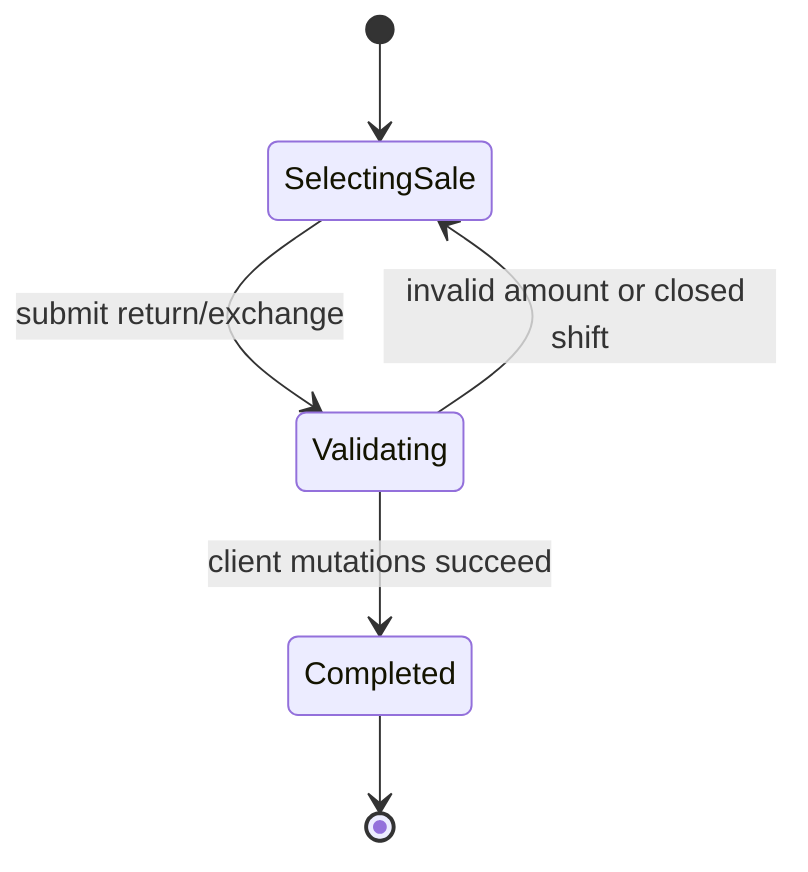
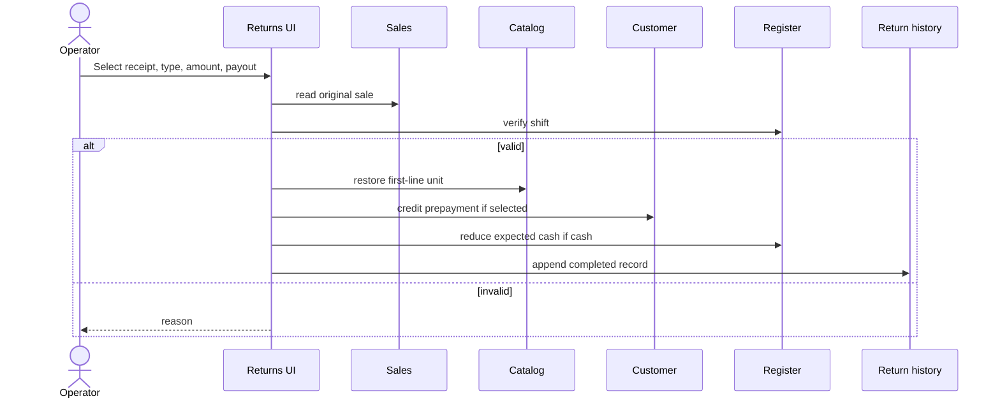

# Returns Module

## Purpose

Returns records a return or exchange against an existing sale, restores stock, adjusts cash or customer prepayment, and appends operational history. It does not yet calculate line-level refundable quantities, taxes, discounts, or exchange baskets.

## Related Screens

- `/returns`: completed-return history and process dialog.
- Public entry: `modules/returns/index.ts`.

## Functionality

Select sale; choose return/exchange; enter amount; choose cash/prepayment payout; validate shift and amount; process; restore stock; adjust drawer or customer balance; append completed record; show errors/success; sort/page history.

## Entities and Fields

`ReturnRecord`: `id`, `saleId`, `customerName`, `type` (`return|exchange`), `amount`, `paymentMethod` (`cash|prepayment`), literal status `completed`, `createdAt`.

## Business Rules

| Status | Rule |
| --- | --- |
| Confirmed | Return amount must be positive and no greater than the selected sale total. |
| Confirmed | Full-register mode requires an open shift. |
| Confirmed | Current implementation restores exactly one unit of the first sale line to stock. |
| Confirmed | Cash payout reduces expected drawer cash; prepayment payout credits the customer account. |
| Confirmed | History records are appended as completed and not edited in the UI. |
| Conflict | User enters an amount independent of product quantity, while stock restoration always uses first line ×1. |
| Conflict | Repeated returns can exceed the original sale because remaining refundable amount is not tracked. |
| Open question | Exchange workflow, tax/discount allocation, tender reversal, and fiscal correction requirements. |

## States and Transitions



## User Flows



## Current Data Handling

Sales, products, customers, and session are persisted client stores. Return history persists under `dinopos-v6-operations`. Orchestration is synchronous browser code without rollback or external payment/fiscal integration.

## Future Frontend/Backend Contracts

### Create return

| Item | Proposal |
| --- | --- |
| Method/endpoint | `POST /api/v1/returns` |
| Consumer | Returns dialog |
| Validation/errors | sale/line returnable quantity, amount/tax/tender, shift, permission; `409 ALREADY_RETURNED/STOCK_STATE`; `422` |
| Permission/effects | `returns:create`; atomic refund, sale return ledger, stock, customer/drawer, fiscal correction |
| Idempotency/loading/retry | required; disable submit; retry same key only; never optimistic |

```json
{
  "saleId": "sale_01J...",
  "type": "return",
  "lines": [{ "saleLineId": "line_1", "quantity": 1 }],
  "refundTender": "cash",
  "reasonCode": "customer_return"
}
```

```json
{
  "data": {
    "id": "ret_01J...",
    "status": "completed",
    "refundTotal": 790000,
    "currency": "UZS",
    "fiscalization": { "status": "completed" }
  },
  "meta": { "requestId": "req_01J..." }
}
```

## Dependencies

Uses Sales, Catalog, Customers, Operations, Session/Register, and shared UI. Reports/Inventory should eventually consume server return/ledger data. All client mutations should become one backend command.

## Open Questions

Partial/multiple returns, exchange pricing, return windows/reasons, damaged stock location, fiscal/payment reversal, approval permissions, and receipt output are unresolved.

